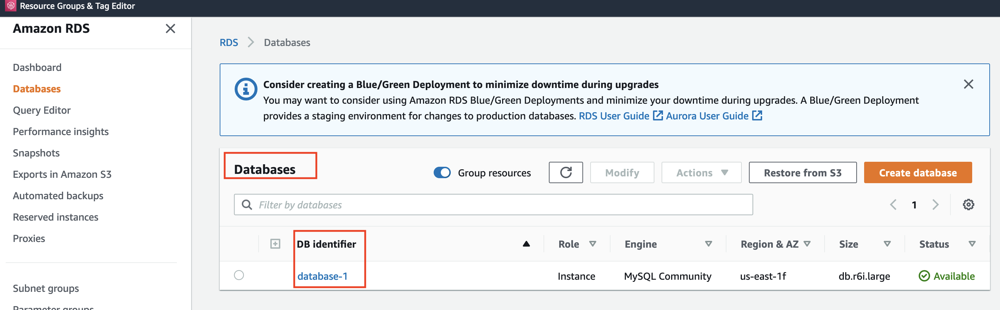
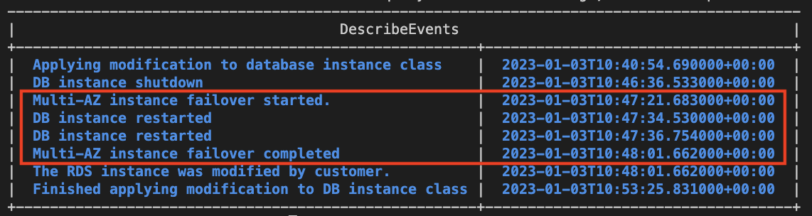

# Scale RDS 
Run script with command below
`rds-scale 'database identifier' 'new instance class'`

For Example:

`rds-scale database-1 db.r6i.large`

Pick instance class at [here](https://docs.aws.amazon.com/AmazonRDS/latest/UserGuide/Concepts.DBInstanceClass.html)

DB Identifier can find at

## Reference
Follow [Modify DB instance command](https://docs.aws.amazon.com/cli/latest/reference/rds/modify-db-instance.html)

## Downtime

The duration of downtime (not Multi-AZ instance) can be in this period:
